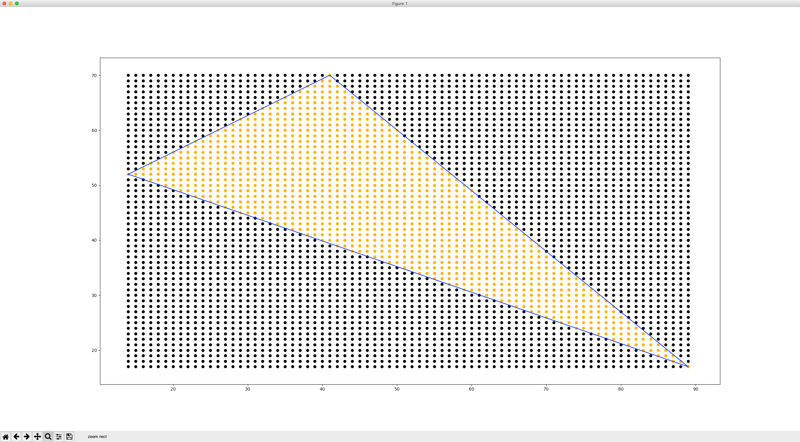

# points_in_triangle

Returns all valid whole number coordinate pairs that are contained inside a triangle. 
Triangle must be defined by three points with integer coordinates.

Strategy taken from: [here](https://blackpawn.com/texts/pointinpoly/default.html)

